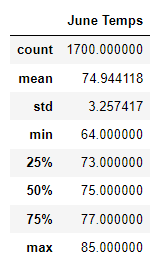
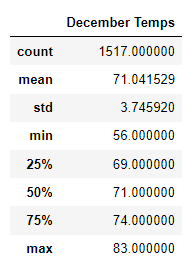
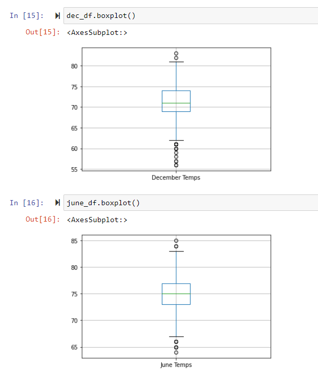

# Surfs_up Overview:
This analysis is to determine temperature trends in the months of both June and December. This analysis will allow us
to determine if Oahu, Hawaii has a condusive climate to open a surf/ice cream shop that will prove to be successful year round. 
In our analysis we had first run the precipitaion reports in order for W. Avy move forward with the project, once completed we 
moved to our temperature analysis with our findings reflected below. The analysis results will be taken to the board for review.

# Surfs_up Results:
### Temperature overview by month:
 

## 3 key differences reflected in our analysis results:
- The minimum temp for June is 64, where in December it is 56. This 9 degree seperation looks to be an outlier in the 
overall view, but should be reflected as a distinct difference.
- The range in temperature is almost 10 degrees lower in December compared to June for the minimum temperature range, on 
the flip side we see the temperature range for June is 5 degrees higher on the maximum temperate range.
- The month of December sees far more outliers in the lower temperature range compared to June which could prove to be a 
wildcard factor.

# Surfs_up Summary:

The overall temperature ranges prove to be pretty consistent in comparing the 2 months of June and December, this is helpful
in understanding the view of the year for potential variations based on the warmer and cooler months. Where we see small differences
based on month, we also notice that average temperature is within 4 degrees. This helps us know that the sustainability of the
shop is likely to be successful year round. 

## Two additional query options for furthered results:
- We can run a query for a more indepth view of the precipitation ranges to determine how much rainfall we see varying by month.
- In conjunction we can run a query to line up the temperatures with the precipitation on any given day to determine
if the rain coincides with the lower temperatures which could impact the desire to come in for ice cream even if they
don't plan to surf.
